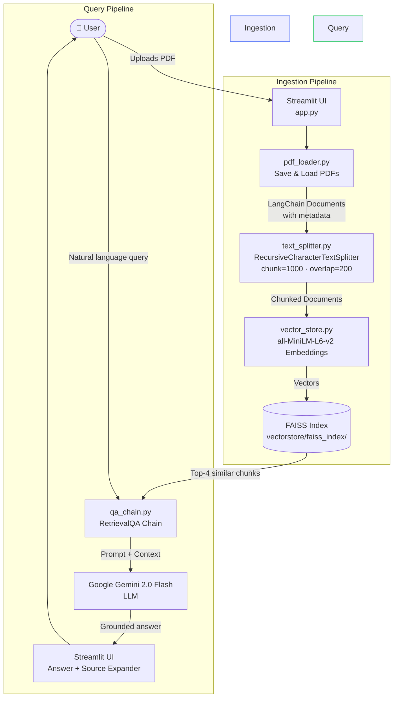

<div align="center">

# ⚖️ LegalMind

### RAG-Based Legal Document Q&A System

*Upload any legal PDF. Ask anything. Get grounded, citation-backed answers — no hallucinations.*

[](https://www.python.org/)
[](https://streamlit.io/)
[](https://www.langchain.com/)
[](https://ai.google.dev/)
[](https://faiss.ai/)
[](LICENSE)

<br/>

[Features](#-features) · [Architecture](#-system-architecture) · [Tech Stack](#-tech-stack) · [Installation](#-installation--setup) · [Usage](#-usage) · [Project Structure](#-project-structure) · [API Reference](#-module-api-reference) · [Roadmap](#-roadmap)

</div>

---

## 📌 Overview

**LegalMind** is a production-grade Generative AI application that lets lawyers, paralegals, researchers, and students interact with legal PDF documents using plain natural language. It leverages a full **Retrieval-Augmented Generation (RAG)** pipeline to ensure every answer is grounded in the actual text of the uploaded documents — eliminating the hallucination problem common to bare LLM queries.

> [!IMPORTANT]
> LegalMind is an **AI assistant tool** designed to aid legal research and document review. It is **not a substitute for qualified legal advice**. Always consult a licensed attorney for legal decisions.

### Why RAG for Legal Documents?

| Approach | Hallucination Risk | Accuracy | Cites Source? |
|---|---|---|---|
| Bare LLM (no context) | 🔴 High | ⚠️ Unreliable | ❌ |
| Fine-tuned LLM | 🟡 Medium | ✅ Better | ❌ |
| **RAG (LegalMind)** | 🟢 Low | ✅ High | ✅ **Yes** |

The RAG approach retrieves verbatim chunks from the document before sending them to the LLM, anchoring every response to real source material. The UI exposes the exact retrieved chunks alongside each answer so users can verify the source themselves.

---

## ✨ Features

<details>
<summary><strong>📄 Multi-Document PDF Ingestion</strong></summary>

Upload one or more legal PDFs simultaneously. Files are persisted to `data/uploaded_pdfs/` and loaded via LangChain's `PyPDFLoader`, which preserves per-page metadata (`source`, `page`) for accurate source attribution later.

</details>

<details>
<summary><strong>🔍 Semantic Vector Search</strong></summary>

Documents are embedded using `all-MiniLM-L6-v2` (a 384-dimension Sentence Transformer) and indexed with FAISS. At query time, the top-4 most semantically similar chunks are retrieved — far more powerful than keyword search because it understands *meaning*, not just exact words.

</details>

<details>
<summary><strong>🤖 Natural Language Q&A with Source Citations</strong></summary>

Ask any question in plain English. The system retrieves relevant context and passes it to **Gemini 2.0 Flash**, which generates a grounded answer. Every answer is accompanied by an expandable panel showing the exact source chunks (page number + file name) that informed the response.

</details>

<details>
<summary><strong>📑 One-Click Document Summarization</strong></summary>

Generates a concise plain-language summary of the entire uploaded document — useful for quickly grasping the nature of a contract or agreement before diving into specifics.

</details>

<details>
<summary><strong>📌 Key Clause Extraction</strong></summary>

Automatically identifies and lists the important legal clauses (e.g., indemnification, limitation of liability, termination, governing law) from the document.

</details>

<details>
<summary><strong>⚠️ Legal Risk Analysis</strong></summary>

Scans the document for potential legal risks, ambiguous language, obligations, and liabilities — surfacing issues that might require closer review.

</details>

<details>
<summary><strong>💾 Persistent FAISS Index</strong></summary>

The vector store is saved to disk at `vectorstore/faiss_index/` after every processing run. On application restart, the last index is automatically reloaded — no need to re-process documents every session.

</details>

<details>
<summary><strong>🔑 Runtime API Key Injection</strong></summary>

The Google Gemini API key can be entered directly in the sidebar at runtime, so the application can be shared or deployed without embedding secrets in the environment.

</details>

---

## 🏗️ System Architecture

The full pipeline from PDF upload to AI-generated answer:



### Data Flow Detail

```
PDF File(s)
    │
    ▼
PyPDFLoader                  ← Preserves page numbers & source filename
    │
    ▼
RecursiveCharacterTextSplitter
    ├─ chunk_size    = 1000 chars
    ├─ chunk_overlap = 200  chars   ← Prevents context loss at boundaries
    └─ separators    = ["\n\n", "\n", " ", ""]
    │
    ▼
HuggingFaceEmbeddings
    └─ model: all-MiniLM-L6-v2     ← 384-dim vectors, fast & accurate
    │
    ▼
FAISS Vector Index
    └─ saved to: vectorstore/faiss_index/
    │
    ▼  (at query time)
Similarity Search (k=4)            ← Top-4 most relevant chunks
    │
    ▼
RetrievalQA (chain_type="stuff")   ← Stuffs all chunks into one prompt
    │
    ▼
ChatGoogleGenerativeAI
    └─ model: gemini-2.0-flash
    └─ temperature: 0.2            ← Low temp = factual, deterministic
    │
    ▼
Answer + source_documents[]
```

---

## 🛠️ Tech Stack

| Layer | Technology | Version | Purpose |
|---|---|---|---|
| **UI** | [Streamlit](https://streamlit.io/) | Latest | Interactive web frontend |
| **RAG Framework** | [LangChain](https://www.langchain.com/) | 0.x | Pipeline orchestration |
| **LLM** | [Google Gemini 2.0 Flash](https://ai.google.dev/) | `gemini-2.0-flash` | Answer generation |
| **Embeddings** | [Sentence Transformers](https://www.sbert.net/) | `all-MiniLM-L6-v2` | Semantic vector encoding |
| **Vector Database** | [FAISS](https://faiss.ai/) | CPU | Similarity search index |
| **PDF Parsing** | [PyPDF](https://pypdf.readthedocs.io/) | Latest | Text extraction from PDFs |
| **Environment** | [python-dotenv](https://pypi.org/project/python-dotenv/) | Latest | `.env` secret management |
| **Language** | Python | 3.11+ | Runtime |

---

## 📂 Project Structure

```
LegalMind/
│
├── app.py                      # 🎯 Main Streamlit application entry point
│                               #    Handles UI layout, state, and button logic
│
├── requirements.txt            # 📦 All Python dependencies (pip install -r)
├── .env.example                # 🔑 Template for environment variables
├── .gitignore                  # 🚫 Excludes venv, data, vectorstore, .env
├── README.md                   # 📖 Project documentation
│
├── data/
│   └── uploaded_pdfs/          # 📁 Runtime storage for user-uploaded PDFs
│                               #    (auto-created; excluded from git)
│
├── vectorstore/
│   └── faiss_index/            # 🗄️ Persisted FAISS index (auto-created)
│       ├── index.faiss         #    Binary vector index
│       └── index.pkl           #    Document store + metadata
│
└── src/                        # 🧩 Core pipeline modules
    ├── pdf_loader.py           #    PDF save & LangChain document loading
    ├── text_splitter.py        #    Recursive chunking with overlap
    ├── vector_store.py         #    Embedding model + FAISS create/load
    └── qa_chain.py             #    RetrievalQA + Gemini + bonus features
```

---

## ⚙️ Installation & Setup

### Prerequisites

Make sure the following are installed on your system:

- ✅ **Python 3.11+** — `python --version`
- ✅ **pip** — `pip --version`
- ✅ A **Google Gemini API key** — obtain from [Google AI Studio](https://aistudio.google.com/app/apikey)

---

### Step 1 — Clone the Repository

```bash
git clone https://github.com/your-username/LegalMind.git
cd LegalMind
```

---

### Step 2 — Create a Virtual Environment

```bash
# Windows
py -3.11 -m venv venv
venv\Scripts\activate

# macOS / Linux
python3.11 -m venv venv
source venv/bin/activate
```

> [!TIP]
> Always activate your virtual environment before running any commands. Your terminal prompt should show `(venv)` when active.

---

### Step 3 — Install Dependencies

```bash
pip install -r requirements.txt
```

This installs:

| Package | Role |
|---|---|
| `streamlit` | Web UI framework |
| `langchain` + `langchain-community` | Core RAG orchestration |
| `langchain-google-genai` | Gemini LLM integration |
| `langchain-huggingface` | HuggingFace embeddings bridge |
| `langchain-text-splitters` | Document chunking |
| `faiss-cpu` | Local vector similarity search |
| `sentence-transformers` | `all-MiniLM-L6-v2` model |
| `pypdf` | PDF text extraction |
| `python-dotenv` | `.env` file loading |

---

### Step 4 — Configure Environment Variables

Copy the example file and fill in your API key:

```bash
# Copy template
cp .env.example .env
```

Edit `.env`:

```env
GOOGLE_API_KEY=your_gemini_api_key_here
```

> [!NOTE]
> You can also skip this step and enter the API key directly in the sidebar at runtime. The sidebar input takes precedence over the `.env` value.

---

### Step 5 — Run the Application

```bash
python -m streamlit run app.py
```

The app will open automatically at **[http://localhost:8501](http://localhost:8501)**.

---

## 🖥️ Usage

### Standard Q&A Workflow

```
1.  Open the app in your browser
2.  Enter your Google Gemini API key in the sidebar (if not in .env)
3.  Click "Browse files" → select one or more legal PDFs
4.  Click "Process Documents" and wait for the success message
5.  Type your legal question in the query box
6.  Click "Ask" to receive a grounded answer
7.  Expand "Show Source References" to verify the retrieved context
```

### Quick Action Buttons

After processing, three one-click actions are available:

| Button | Underlying Query Sent to LLM |
|---|---|
| 📑 **Summarize Document** | `"Summarize this legal document in simple language."` |
| 📌 **Key Clause Extraction** | `"Extract the key legal clauses from this document."` |
| ⚠️ **Legal Risk Analysis** | `"Analyze the possible legal risks mentioned in this document."` |

### Example Queries

```
What are the termination conditions in this agreement?

Who bears liability in case of a data breach?

What obligations does the first party have under this contract?

Is there a non-compete clause, and what are its terms?

Summarize the governing law and jurisdiction section.

What happens if either party defaults on payment?
```

---

## 📐 Module API Reference

### `src/pdf_loader.py`

```python
save_uploaded_files(uploaded_files: list) -> List[str]
```
Accepts Streamlit `UploadedFile` objects, writes them to `data/uploaded_pdfs/`, and returns their local file paths.

```python
load_pdf_documents(file_paths: List[str]) -> List[Document]
```
Iterates over paths, loads each via `PyPDFLoader`, and returns a flat list of LangChain `Document` objects with `source` and `page` metadata.

---

### `src/text_splitter.py`

```python
split_documents(
    documents: List[Document],
    chunk_size: int = 1000,
    chunk_overlap: int = 200
) -> List[Document]
```
Splits documents using `RecursiveCharacterTextSplitter` with the separator hierarchy `["\n\n", "\n", " ", ""]`. The 200-character overlap prevents context from being lost at chunk boundaries — critical for legal clauses that span paragraph breaks.

---

### `src/vector_store.py`

```python
get_embeddings_model() -> HuggingFaceEmbeddings
```
Returns an instance of `all-MiniLM-L6-v2` — a 22M parameter model producing 384-dim vectors. Chosen for its balance of speed and semantic accuracy.

```python
create_and_save_vector_store(documents: List[Document]) -> FAISS
```
Generates embeddings, builds a FAISS L2 index, saves it to `vectorstore/faiss_index/`, and returns the live index object.

```python
load_vector_store() -> FAISS | None
```
Reloads a persisted FAISS index from disk. Returns `None` if no index exists yet. Uses `allow_dangerous_deserialization=True` (safe here since the index is user-generated locally).

---

### `src/qa_chain.py`

```python
generate_answer(vector_store: FAISS, question: str) -> tuple[str, List[Document]]
```
Builds a `RetrievalQA` chain (`chain_type="stuff"`) backed by Gemini 2.0 Flash (`temperature=0.2`), retrieves top-4 similar chunks, and returns `(answer_text, source_documents)`.

```python
summarize_document(vector_store: FAISS) -> tuple[str, List[Document]]
extract_key_clauses(vector_store: FAISS) -> tuple[str, List[Document]]
analyze_legal_risks(vector_store: FAISS) -> tuple[str, List[Document]]
```
Convenience wrappers around `generate_answer` with pre-defined legal prompts.

---

## 🎯 Key Engineering Decisions

| Decision | Rationale |
|---|---|
| `chain_type="stuff"` | Concatenates all retrieved chunks into a single prompt. Simpler and more effective than `map_reduce` for the 4-chunk retrieval window used here. |
| `temperature=0.2` | Low temperature reduces creative drift and keeps the LLM factual and deterministic — essential for legal contexts. |
| `chunk_overlap=200` | Prevents clauses that span paragraph breaks from being split across two disconnected chunks with no shared context. |
| `k=4` retrieval | Balances context richness vs. prompt length. Four 1000-char chunks ≈ 4000 chars of context, well within Gemini's context window. |
| `all-MiniLM-L6-v2` | Fast inference (22M params), no GPU required, strong semantic performance on English legal text. |
| Local FAISS persistence | Eliminates cold-start re-processing on every session restart. Index survives application restarts. |

---

## 🐛 Common Issues & Fixes

<details>
<summary><strong>❌ <code>faiss-cpu</code> import error on Windows</strong></summary>

```bash
pip uninstall faiss-cpu
pip install faiss-cpu --no-cache-dir
```
If still failing, ensure you are using **Python 3.11** (not 3.12+, which has known FAISS wheel issues on some platforms).

</details>

<details>
<summary><strong>❌ <code>google.api_core.exceptions.InvalidArgument</code> from Gemini</strong></summary>

Your API key is invalid or has no quota. Verify it at [Google AI Studio](https://aistudio.google.com/app/apikey) and ensure the **Generative Language API** is enabled in your Google Cloud project.

</details>

<details>
<summary><strong>❌ Documents processed but answers are off-topic</strong></summary>

The FAISS index may contain stale data from a previous session. Delete the index directory and re-process:

```bash
rm -rf vectorstore/
```
Then re-upload and re-process your documents.

</details>

<details>
<summary><strong>❌ <code>allow_dangerous_deserialization</code> warning</strong></summary>

This is expected. The FAISS index was built locally by the application itself, so loading it is safe. This flag is a LangChain safeguard against loading indices from untrusted external sources.

</details>

---

## 🔮 Roadmap

### Near-term

- [ ] **Chat history** — maintain multi-turn conversational context per session
- [ ] **Citation highlighting** — highlight the exact sentence in the PDF that sourced the answer
- [ ] **OCR support** — handle scanned/image-based PDFs via Tesseract
- [ ] **Multi-document comparison** — compare clauses across two contracts side-by-side

### Mid-term

- [ ] **ChromaDB / Qdrant backend** — swap FAISS for a production vector database
- [ ] **Docker containerisation** — one-command `docker compose up` deployment
- [ ] **Authentication** — user accounts with per-user document namespaces
- [ ] **Async processing** — non-blocking document ingestion for large files

### Long-term

- [ ] **Cloud deployment** — AWS / GCP / Azure with Terraform IaC
- [ ] **Fine-tuned legal embeddings** — replace `all-MiniLM-L6-v2` with a domain-specific legal embedding model
- [ ] **Agentic workflows** — multi-step reasoning for complex legal queries
- [ ] **PostgreSQL + pgvector** — full relational + vector hybrid storage

---

## 🧑‍💻 Author

<div align="center">

**Auditee Chowdhury**

*AI/ML · Generative AI · Data Science · Full Stack Development*

[](https://linkedin.com/in/your-profile)
[](https://github.com/your-username)

</div>

---

## 📄 License

This project is licensed under the **MIT License** — see the [LICENSE](LICENSE) file for details.

```
MIT License — Copyright (c) 2024 Auditee Chowdhury

Permission is hereby granted, free of charge, to any person obtaining a copy
of this software to use, copy, modify, merge, publish, distribute, sublicense,
and/or sell copies of the Software, subject to the above copyright notice
appearing in all copies.
```

---

## ⭐ Acknowledgements

- [LangChain](https://www.langchain.com/) for the RAG framework and chain abstractions
- [Google DeepMind](https://deepmind.google/) for the Gemini API
- [Meta AI Research](https://ai.meta.com/) for the FAISS library
- [Sentence Transformers](https://www.sbert.net/) for `all-MiniLM-L6-v2`
- [Streamlit](https://streamlit.io/) for making ML apps effortless to build

---

<div align="center">

If this project helped you, please consider giving it a ⭐ — it helps others discover it.

*Built with ❤️ and ⚖️ by Auditee Chowdhury*

</div>
